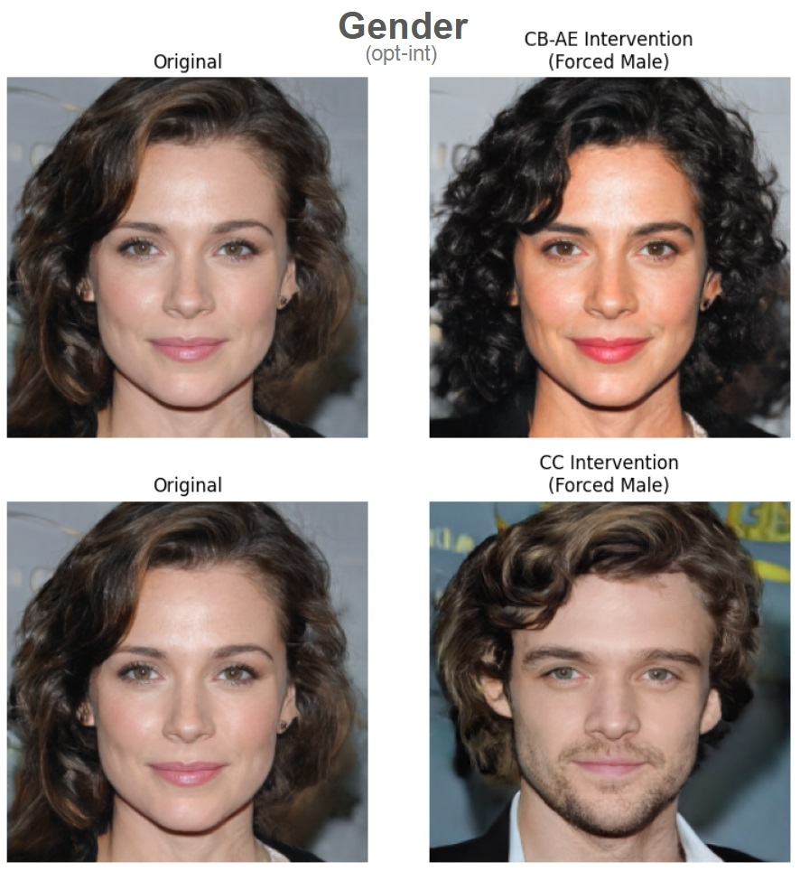
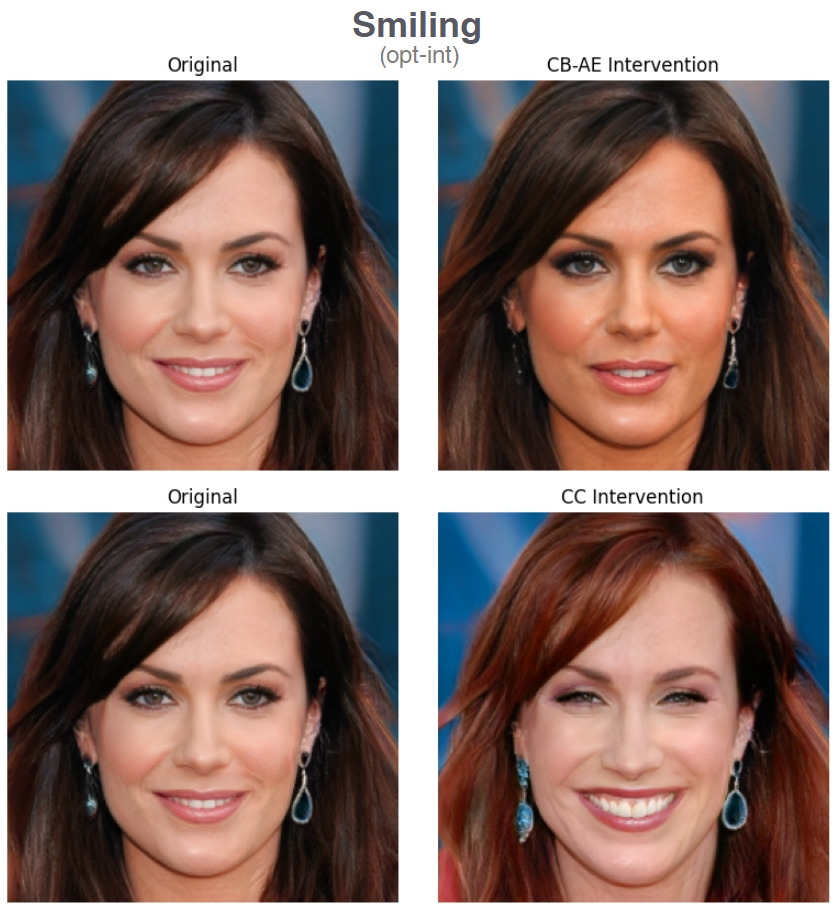
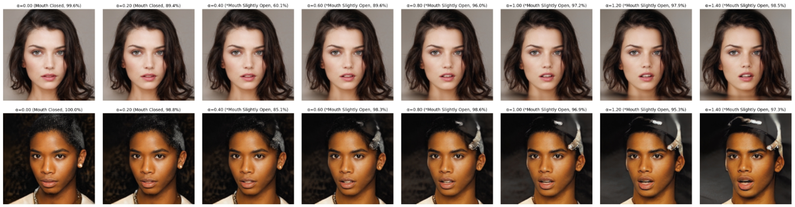

# Interpretable Generative Models through Post-hoc Concept Bottlenecks (CVPR 2025) [Reproduction]

**Authors**: Benjamin TenWolde, Yijia Tang, Yacun Wang, Yixuan Li

We attempt to reproduce parts of the experiments **CVPR 2025** paper: [Interpretable Generative Models through Post-hoc Concept Bottlenecks](https://arxiv.org/abs/2503.19377) and make further analysis to the concept quality and control strengths, as originally implemented in this [GitHub Repository](https://github.com/Trustworthy-ML-Lab/posthoc-generative-cbm).

* The paper proposed two novel methods to enable interpretability for generative models:
  * **CB-AE**: The 1st method for post-hoc interpretable generative models. **CB-AE** can be trained efficiently with a frozen pretrained generative model, without real concept-labeled images.
  * **Concept Controller**: An optimization-based concept intervention method with improved steerability and higher image quality.
* The paper shows the purposed methods have **higher steerability** (+31% and +28% better than prior SOTA) and **lower cost** (4-15x faster to train) on deep generative models including GANs and diffusion models.

<p align="center">
    
</p>

## Setup

We present the setup for our reproduction environments, which focused on the CelebA-HQ and CUB datasets and the StyleGAN2 backbone model.

### Environment setup instructions

* Conda environment installation:

    ```sh
    conda create -n posthocgencbm python=3.8
    conda install nvidia/label/cuda-11.7.0::cuda-nvcc cudatoolkit
    pip install torch==1.13.1+cu117 torchvision==0.14.1+cu117 torchaudio==0.13.1 --extra-index-url https://download.pytorch.org/whl/cu117
    pip install -r requirements.txt
    ```

* Download the CelebA-HQ-pretrained StyleGAN2 base model from [below](#download-base-model-and-cb-aecc-weights) and test the environment using `python3 eval/test_stygan2.py`. It should save a StyleGAN2 generated image in `images/`. If you get CUDA runtime errors (during "Setting up PyTorch plugin..."), use this:

    ```sh
    export CUDA_HOME=$CONDA_PREFIX
    export CPLUS_INCLUDE_PATH=$CUDA_HOME/include:$CPLUS_INCLUDE_PATH
    export LIBRARY_PATH=$CUDA_HOME/lib:$LIBRARY_PATH
    ```

* We use `models/checkpoints` for saving/loading CB-AE/CC checkpoints and classifier weights

    ```sh
    mkdir models/checkpoints
    cd models/checkpoints
    ```

### Download base model and CB-AE/CC weights

* CelebA-HQ-pretrained StyleGAN2 (from [[2]](#sources)):

    ```sh
    ## base model weights (for training + evaluation)
    wget https://api.ngc.nvidia.com/v2/models/nvidia/research/stylegan2/versions/1/files/stylegan2-celebahq-256x256.pkl

    ## CB-AE weights (for evaluation)
    gdown https://drive.google.com/uc?id=1RBdjcBDbpAoW5qOkG-rBonIpcBApBF-q

    ## CC weights (for evaluation)
    gdown https://drive.google.com/uc?id=1fh2XV2ttrCc88-SgfR9f-JcwG1eent_U
    ```

* CUB-pretrained StyleGAN2 (trained using [[4]](#sources)):

    ```sh
    ## base model weights (for training + evaluation)
    gdown https://drive.google.com/uc?id=1sW7WgvUFH2REZPQx88BjFneoItP9C0XB
    ```

### Download concept classifier weights

Considering limitations on hardware and experiments, we have only used one set of classifier weights for each dataset

* CelebA-HQ (256x256): ResNet18

    ```sh
    gdown https://drive.google.com/uc?id=1xbR7MbERV7wMnU4WcsNSDriYXBqsy_jZ
    unzip celebahq_rn18_conclsf.zip
    ```

* CUB (256x256): ResNet50

    ```sh
    gdown https://drive.google.com/uc?id=1vW5Q41FGHXdTqbraz54AXQ2uoBKispLD
    unzip cub_rn50_conclsf.zip
    ```

* Other concept classifiers can be trained using `train/train_conclsf.py`.

## Training

* The bash script `scripts/train_cbae.sh` provides commands to train a CB-AE for a CelebA-HQ-pretrained or CUB-pretrained StyleGAN2 with supervised classifiers as pseudo-label source.
* Some important arguments specified are:
  * `-e`: specify which config file from the `config/` folder to use (e.g. `cbae_stygan2`).
  * `-d`: specify dataset of base generative model (e.g. `celebahq`).
  * `-t`: specify experiment name to be used as a suffix for saving logs, checkpoints, etc.
  * `-p`: specify pseudo-label source $M$ for CB-AE/CC training (e.g. `supervised` for supervised-trained classifiers, `clipzs` for zero-shot CLIP classifiers, `tipzs` for few-shot adapted CLIP).

## Evaluation

We have provided two bash scripts for evaluating steerability and concept accuracy metrics that best adapts to the original repository code. Note both files only support the experiments we reproduced, which is different from the original paper.

* Use `bash scripts/eval_intervention_reproduce.sh <dataset> <arch> [optint]` for quantitatively running steerability evaluation for a CelebA-HQ (or CUB) StyleGAN2 CB-AE (or CC).
  * The command line arguments for the bash script are, in this order:
    * `dataset`: specify dataset to evaluate (i.e. `celebahq` or `cub`).
    * `arch`: the architecture to evaluate (i.e. `cbae` or `cc`).
    * `optint`: whether to use optimization-based interventions (not using this will use CB-AE interventions, default `false`). Note `cc` only supports `optint=true`.

* Use `bash scripts/eval_concept_reproduce.sh <dataset> <arch>` for quantitatively running concept accuracy evaluation for a CelebA-HQ (or CUB) StyleGAN2 CB-AE (or CC).
  * The command line arguments for the bash script are, in this order:
    * `dataset`: specify dataset to evaluate (i.e. `celebahq` or `cub`).
    * `arch`: the architecture to evaluate (i.e. `cbae` or `cc`).

## Extension Experiments

We have provided three extension experiments in jupyter notebook format:

* `notebooks/visualize_interventions.ipynb`: Using pretrained StyleGAN + CelebA-HQ CB-AE framework.
  * **Concept Entanglement**: Evaluate concept interventions and their effects on other untargeted concepts (swap + PGD): visualizing examples; quantifying the results
  * **Concept Interpolation**: Concept Interpolation/Extrapolation: Visualizing examples

* `random_concepts.ipynb`: Trained StyleGAN + CelebA-HQ CB-AE framework using dummy concepts.
  * **Concept Leakage**: Evaluate concept interventions on StyleGAN + CelebA-HQ trained on random concepts (swap + PGD): visualizing examples; quantifying the results
  * *Training Details*: Edit `config/cbae_stygan2_thr90` and `train/train_cbae_gan.py` to use dummy concepts and specify `-p clipzs` to use zero-shot CLIP classifer.
  * *Trained Weights*: Download through [link](https://drive.google.com/file/d/15SqpFoEKwIES1ADVPInPzot-ULO_mPzU/view?usp=sharing).

## Key Results

### 1. Concept Steerability (Intervention Success Rate)

* The paper claimed stated CB-AE and CC improves steerability across GANs (+31%) and diffusion models (+28%) over the prior state-of-the-art method CBGM [[1]](#sources) while being 4-15x faster to train on average.
* Reproduction on StyleGAN2 backbone: Our Result (Paper Result)

    | Steerability (%)      | CUB | CelebA-HQ |
    |-------------|---------------------|-------------|
    | **CB-AE**  | ~0* (10.52)                |  41.73 (40.27)         |
    | **CB-AE+opt-int**   | 63.60 (65.11)        | 56.90 (61.66)     |
    | **CC+opt-int**      | 65.28 (44.72)     | 68.10 (67.95)      |

    \* At this time, we have no clue since all other experiments report expected numbers.
* Some Examples from the paper:

<p align="center">
    
</p>

### 2. Optimization-based Interventions

* Could enable controllable generation with improved orthogonality at test time
* Some Examples from Reproduction

<p align="center">
    
    
</p>

### 3. Concept Interpolation (Fine-Grained Control)

* Some Examples from Reproduction

<p align="center">
    
</p>

### 4. Concept Accuracy (Alignment)

* Reproduction on StyleGAN2 backbone: Our Result (Paper Result)

    | Accuracy (%)      | CUB | CelebA-HQ|
    |-------------|---------------------|-------------|
    | **CB-AE**   | 74.97 (81.33)               | 92.08 (86.04)        |
    | **CC**      | 83.08 (81.11)        | 93.63 (83.57)        |

## Sources

[1] CBGM (ICLR 2024): [https://github.com/prescient-design/CBGM](https://github.com/prescient-design/CBGM)

[2] [StyleGAN3 GitHub repo](https://github.com/NVlabs/stylegan3?tab=readme-ov-file#additional-material) (it has StyleGAN2 pretrained weights for CelebA-HQ and CUB)

[3] [CelebA-HQ pretrained DDPM repo](https://huggingface.co/google/ddpm-celebahq-256)

[4] [StyleGAN2-Ada PyTorch GitHub repo](https://github.com/NVlabs/stylegan2-ada-pytorch)

## Citation

A. Kulkarni, G. Yan, C. Sun, T. Oikarinen, and T.-W. Weng, [Interpretable Generative Models through Post-hoc Concept Bottlenecks](https://arxiv.org/abs/2503.19377), CVPR 2025

```txt
@inproceedings{kulkarni2025interpretable
    title={Interpretable Generative Models through Post-hoc Concept Bottlenecks},
    author={Kulkarni, Akshay and Yan, Ge and Sun, Chung-En and Oikarinen, Tuomas and Weng, Tsui-Wei},
    booktitle={IEEE/CVF Conference on Computer Vision and Pattern Recognition},
    year={2025},
}
```
